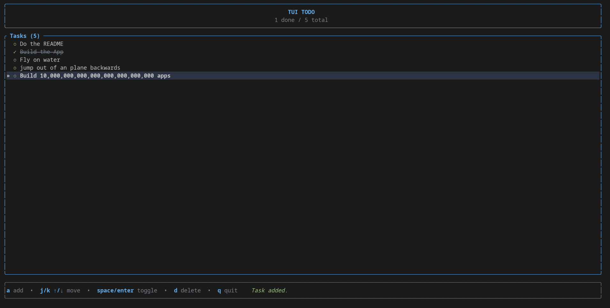

# 📝 TUI TODO

A fast, minimal, and keyboard-driven TODO application built in **Rust** using **Ratatui**, **Serde**, **Serde_JSON** and **Crossterm**.

Designed for developers and terminal enthusiasts who prefer managing tasks without leaving the command line.

---

## Features

* Clean terminal user interface
* Fully keyboard-driven workflow
* Mark tasks as complete/incomplete
* Add new tasks instantly
* Delete tasks
* Automatic persistence using JSON
* Live progress indicator (`completed / total`)
* Modern color palette with highlighted selections and popup dialogs

---

## Preview



## Installation

Clone the repository:

```bash
git clone https://github.com/<your-username>/<repo-name>.git
cd <repo-name>
```

Build and run:

```bash
cargo run
```

Or compile a release build:

```bash
cargo build --release
```

---

## Controls

| Key               | Action                 |
| ----------------- | ---------------------- |
| `a`               | Add a new task         |
| `j` / `↓`         | Move down              |
| `k` / `↑`         | Move up                |
| `Space` / `Enter` | Toggle task completion |
| `d`               | Delete selected task   |
| `Esc`             | Cancel adding a task   |
| `q`               | Quit                   |

---

## Data Storage

Tasks are automatically saved to:

```text
tasks.json
```

The file is created automatically in the application's working directory.

Example:

```json
[
  {
    "description": "Finish Rust project",
    "status": "Pending"
  },
  {
    "description": "Push to GitHub",
    "status": "Done"
  }
]
```

---

## Built With

* Rust
* Ratatui
* Crossterm
* Serde
* serde_json

---

## Project Structure

```text
src/
 └── main.rs

tasks.json      # Generated automatically
Cargo.toml
README.md
```

---

## Future Improvements

* [ ] Task editing
* [ ] Due dates
* [ ] Task priorities
* [ ] Search/filter
* [ ] Categories or tags
* [ ] Multiple task lists
* [ ] Configurable themes
* [ ] Mouse support

---

## Why?

This project was built as a way to explore Rust's terminal ecosystem while creating a simple, responsive, and practical command-line application.

---

## License

This project is licensed under the MIT License. Feel free to use, modify, and distribute it.

